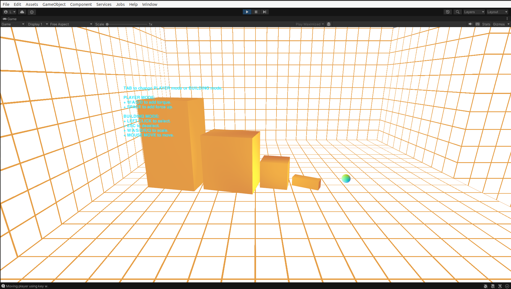

# Unity Interactive Environment

WIP!

Unity 2022.3.13f1, URP, Vulkan.

Pet Project: Graphics Programming / Technical Art for Game development.

## Gameplay

Two ways of player control:
* Modifying the environment 
* Moving the player

```
TAB to change PLAYER mode or BUILDING mode.

PLAYER MODE: 
+ W/A/S/D to add torque.
+ SPACE to add force up.

BUILDING MODE: 
+ LEFT CLICK to select. 
+ ESC to deselect.
+ W/A/S/D/E/Q to scale. 
+ MOUSE MOVE to move. 
```

Gameplay (TODO):
* At game start, generate randomized start and goal positions.
* Player is positioned at start position.
* Player modifies the environment in order to move to the goal position.
* Each environment modification operation must be optimized since it results in penalty points.
* Player is time restricted; laser is moving from bottom to top and if it touches the player the game ends.

## Game Programming / Graphics Programming / Tech Art

Interacting with environment:
* Ray-casting for selection
* Scaling and translation of selected objects
* RBD behaviour

Interacting with player
* RBD behaviour
* Movement using torque and forces

Shaders:
* Normal-based unlit shader for color
* SSS approx using unlit shader: 
   * https://www.ea.com/frostbite/news/approximating-translucency-for-a-fast-cheap-and-convincing-subsurface-scattering-look
* Grid unlit shader:
  * https://bgolus.medium.com/the-best-darn-grid-shader-yet-727f9278b9d8
  * https://www.ronja-tutorials.com/post/011-chessboard/
* TODO: outline shader for selected objects

## Demo:




